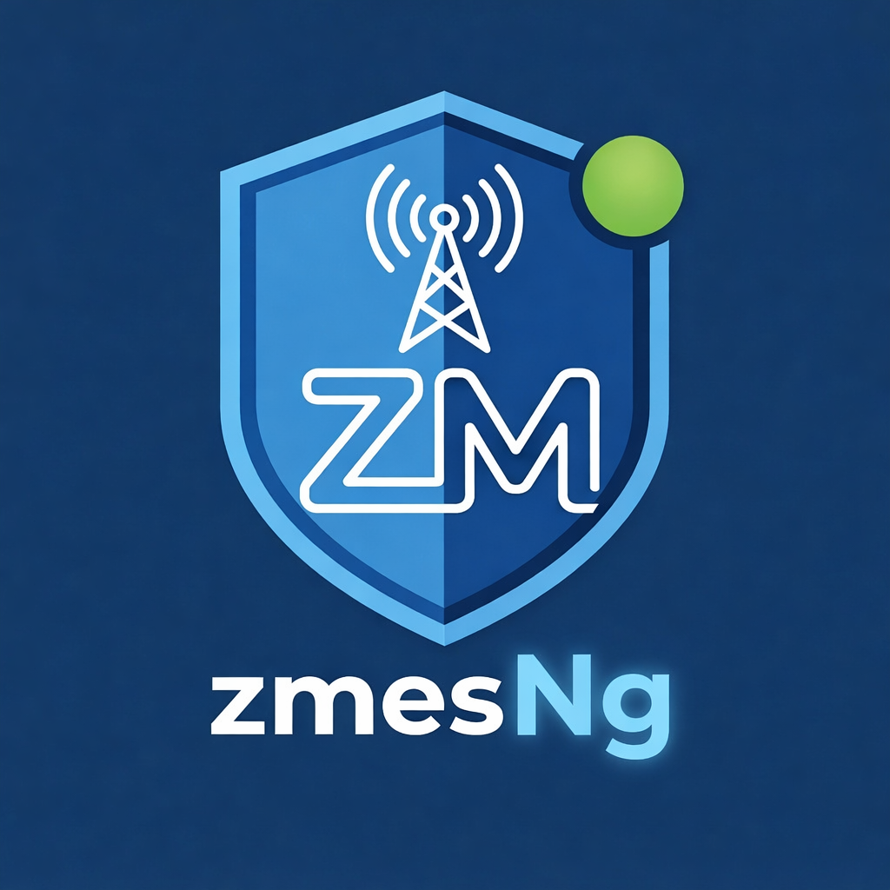

<p align="center">
  
</p>

Note
-----
This is a newer version of ES (7.x) that I'm redoing for zmNinjaNG support and better features.
Read about what is [different](CHANGES.md). 

What
----
The Event Notification Server sits along with ZoneMinder and offers real time notifications, support for push notifications as well as Machine Learning powered recognition.
As of today, it supports:
* detection of 80 types of objects (persons, cars, etc.) 
* face recognition
* deep license plate recognition

Documentation
--------------

Full documentation — installation, configuration, testing, and more — is on **Read the Docs**:

**[zmeventnotificationng.readthedocs.io](https://zmeventnotificationng.readthedocs.io/en/latest/)**

Key pages:
- [Installation](https://zmeventnotificationng.readthedocs.io/en/latest/guides/installation.html)
- [Configuration](https://zmeventnotificationng.readthedocs.io/en/latest/guides/config.html)
- [Testing](https://zmeventnotificationng.readthedocs.io/en/latest/guides/testing.html)
- [Hooks & ML](https://zmeventnotificationng.readthedocs.io/en/latest/guides/hooks.html)

ES 7.0 is in development — expect breakages. If you find issues, please post them to this repo, not ZM repos.

Developer Notes (for myself)
----------------------------
To make a release:
```
./scripts/make_release.sh
```

To test docs:
```
cd docs/
make html && python -m http.server -d _build/html
```

To test a CHANGELOG:
```
# VERSION in project root should be updated
# replace v7.0.0 with whatever future version
GITHUB_TOKEN=$(gh auth token) git-cliff --tag "v7.0.0"
```


Requirements
-------------
- Python 3.10 or above

Screenshots
------------

Click each image for larger versions. Some of these images are from other users who have granted permission for use
###### (permissions received from: Rockedge/ZM Slack channel/Mar 15, 2019)

   
